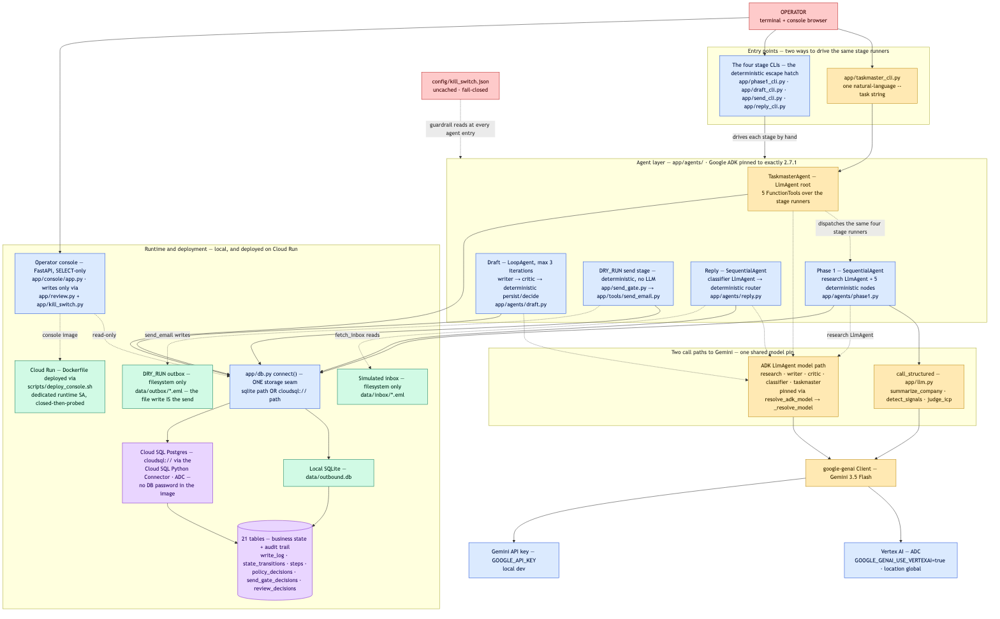
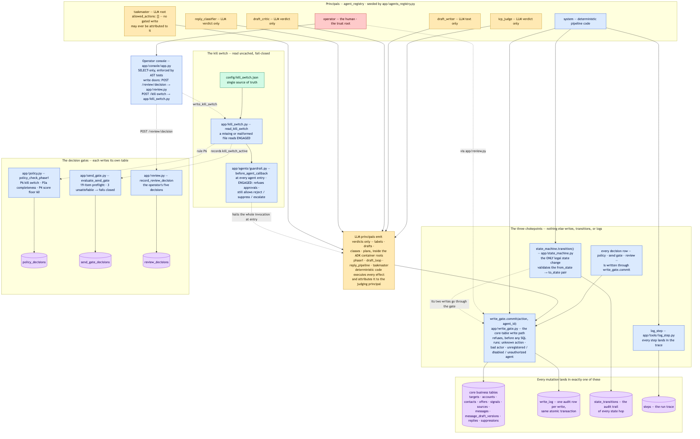
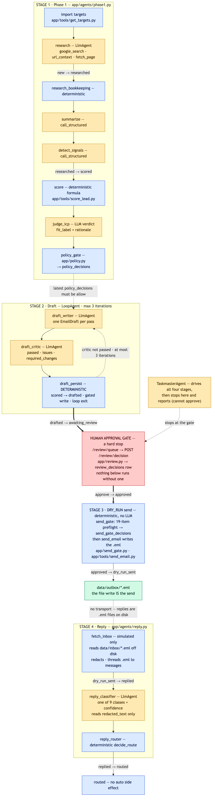
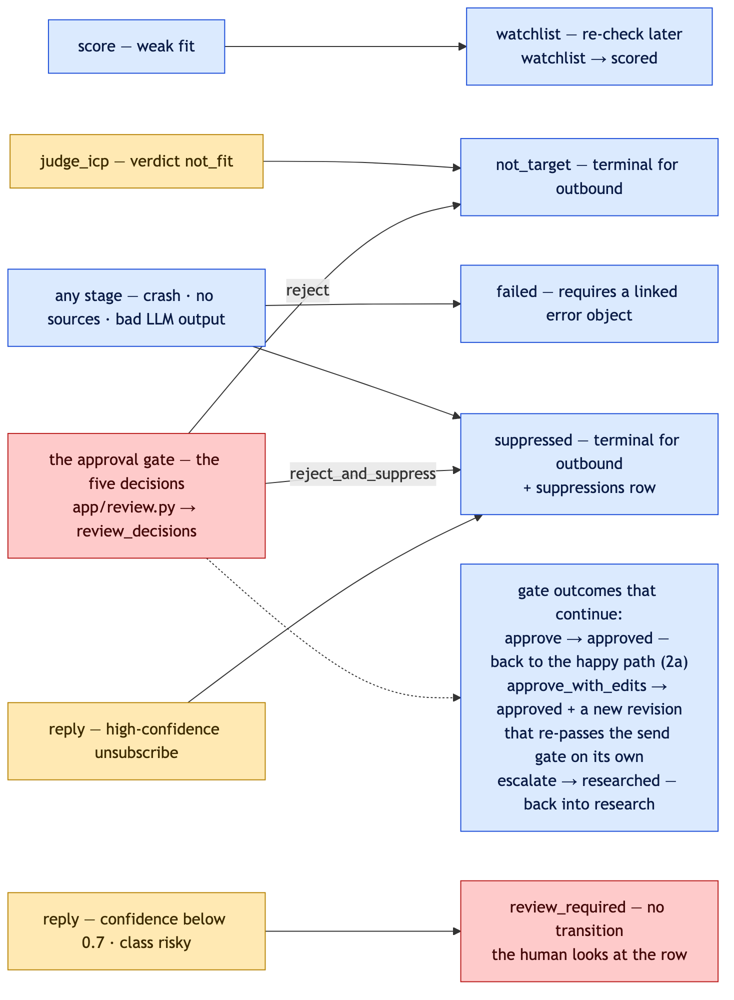

# Outbound Agency

An outbound sales agent with real autonomy and no unsafe moves.

Five Google ADK agents and an LLM judge research companies, score fit, write cold emails,
schedule follow-up calls, and handle replies — and none of them can send an email, approve a
draft, schedule without checking a real calendar, or overwrite anything without passing
through a single audited gate. Built for Google's **All Things Agentic Hackathon**
(Taskmaster track).

Self-use, one-operator harness. Not a SaaS platform, not multi-tenant, not a fully autonomous
sender.

## What it does

One sentence in, four pipeline stages out:

```
python -m app.taskmaster_cli --task "run outreach for the HK therapy clinics offer, 10 targets"
```

A root ADK `LlmAgent` plans and dispatches:

1. **Research** — a tool-choosing agent (`google_search`, `url_context`, a direct page fetch)
   builds a company profile and a set of evidence-tagged signals, each one backed by a quote
   the agent can point to.
2. **Score** — a deterministic 0–100 formula against the offer's ICP, plus an **LLM judge**
   that weighs the same evidence and may override the formula's label — but must write a real
   justification any time it disagrees, or the response is rejected outright.
3. **Draft** — a writer↔critic loop (ADK `LoopAgent`, up to 3 iterations) produces a cold
   email. Every iteration is persisted, critique included.
4. **Human review** — the pipeline stops here, always. A human approves, edits, rejects,
   escalates, or suppresses through a read-only console. Nothing sends itself.

After approval: a 19-item preflight, a DRY_RUN send (a file write — no SMTP exists in this
codebase, enforced by a test that walks every module), a simulated reply, an LLM classifier,
and a deterministic router that suppresses, escalates, or queues a follow-up — which, if the
reply was positive, includes a **real reserved slot on a real computed calendar**, picked by
another LLM agent and re-validated by code before it's ever booked.

A per-invocation wall-clock ceiling means one `taskmaster_cli` call can outrun a large batch
mid-research. `python -m app.autonomous_taskmaster` is a bounded outer loop for exactly that:
it calls the same unmodified CLI repeatedly and, after each call, decides whether to call it
again by reading the same deterministic functions the stage tools already use to pick their own
work — never by trusting the model's own "am I done" claim. `--max-iterations` (default 30)
keeps it honestly bounded rather than looping forever; it adds no new tool and no new write
path, and it still stops at the human approval gate exactly like a single invocation does.

## The design rule

One sentence, enforced by construction everywhere in this codebase:

> **LLM agents only ever produce verdicts. Deterministic code performs every action.**

Concretely:

- **One write path.** Every core-table write goes through a single gate function that checks
  the calling principal's registered capabilities before any SQL executes. No other code path
  in the repo may write to a core table — enforced by a static-analysis test, not a convention.
- **One state path.** Every state change goes through one function, validated against an
  explicit transition table.
- **A kill switch that fails closed.** It's a file, read uncached. A missing or malformed file
  reads as *engaged* — deleting it halts the system rather than disabling the halt.
- **A read-only console.** Two tests parse the console's own source: one refuses any raw
  write-SQL string; the other checks its imports against an allowlist of exactly the two
  modules whose write functions it's permitted to call. Its only doors are the five review
  decisions and the kill-switch toggle.
- **No send transport, anywhere.** A test walks every module in the repo and fails if an SMTP
  or mail-sending import ever appears. There is no live-send code path to accidentally enable.
- **Verdict, then re-validated action — everywhere an LLM has a real decision to make.** The
  ICP judge sets a label but has no field to touch the numeric score policy reads. The draft
  critic's verdict only controls whether the loop exits — every path still lands in human
  review. The scheduling agent picks a slot from a list of real, already-computed openings;
  before that slot is ever reserved, deterministic code re-checks it's still free.

The compliance footer on every email — the unsubscribe link, and (on a follow-up) the
proposed meeting time — has **no field in the model's own output schema**. It is composed by
code, after the model runs, every time. A model cannot omit or mangle what it was never asked
to write.

The deployed console has a `/rules` page — the scoring formula, all nine policy rules, and the
full state-transition table, in one screen. It's hand-verified static text rather than a live
import on purpose: importing the real constants would mean widening the console's own audited
zero-write-path import allowlist, and that guarantee was worth more than the convenience.

`/rules`, `/demo`, and `/test-run` (a static mirror of four real showcase targets and the run
that reserved the real meeting) are reachable with **zero credentials** — an enumerated,
no-wildcard carve-out in the same auth dependency that gates everything else, and every one of
those pages is pre-rendered to disk ahead of time, so a public route never opens a database
connection. Everything else — the full target list, the review queue, the kill switch — stays
behind `OUTBOUND_CONSOLE_API_KEY`.

## Real reply handling and real scheduling

A reply routes to exactly one of nine outcomes: positive replies queue a follow-up draft;
meeting requests notify the operator (deliberately *not* automated); objections are held for a
human, never auto-rebutted; unsubscribes permanently suppress the address. None of this is
scripted per-target — the same classifier and router run on every real reply, dictionary-free.

The follow-up path is where the calendar check happens. A fixed weekly availability template
is projected forward from "now," filtered against every slot any other target has already
taken, and handed to an LLM agent as a short list of real openings. The agent picks one and
states why. Code looks that choice up against the same list it offered — a slot the agent
didn't actually see, or one another run just took, is refused before anything is written. The
email's footer then states a real proposed time, never a placeholder.

## Measuring what actually works, without pretending to learn from it

Every first-touch draft is deterministically assigned one of ten hand-written style hypotheses
(tone, structure, CTA style) — never LLM-generated, never random, a pure function of the
target so a run is reproducible. `scripts/hypothesis_scoreboard.py` computes each hypothesis's
real win/loss record by reading the reply router's own trusted verdict, never a raw
classification the router itself didn't act on — the same confidence-floor discipline that
governs every other decision in this system governs this measurement too.

Each hypothesis's score prints alongside a plain-language verdict — encouraging, discouraging,
or no signal yet — so the reward/penalty judgment is real and visible, not implied.

What it deliberately does **not** do: feed that score, or its verdict, back into which
hypothesis gets tried next. Selection stays a pure function of the target, unaffected by
outcomes. Outcome-linked re-weighting — with the guardrails a responsible version needs
(bounded weights, no drop-to-zero without a human, a full audit trail) — is specified but not
built. A learning loop without its guardrails is worse than no learning loop at all.

## Architecture

<p align="center">
  
</p>
<p align="center">
  
</p>
<p align="center">
  
</p>
<p align="center">
  
</p>

## Technologies used

- **Google ADK** (`google-adk==2.7.1`, pinned) — `LlmAgent`, `LoopAgent`, `SequentialAgent`
  wiring every research/judge/draft/classify/schedule agent.
- **Gemini** via **Vertex AI** in deployment (ADC, `location=global` — 3.x is not served
  regionally) and the Gemini API locally.
- **Google Cloud SQL** (Postgres) — the pipeline's persistent store, behind one connection
  seam (`app/db.py`) that also speaks SQLite for local runs and tests, dialect differences
  handled transparently.
- **Google Cloud Run** — hosts the read-only operator console (FastAPI + Jinja2).
- **Pydantic** — every LLM input/output is a typed, validated schema; no free-form JSON parsing.
- **pytest** — 813 tests, 8 skipped (live-Postgres tests that skip without cloud credentials).

## Data sources

Every fact the research agent uses comes from either `google_search` (results text only — the
model never sees a rendered page) or a direct HTTP fetch of the company's own site, both
logged with the URL and the raw text actually retrieved, so any claim can be checked against
what was really on the page. Nothing is scraped from a third-party data broker or a paid
enrichment API. Company names used in the example data are real, publicly listed businesses;
every contact email is a reserved `.test`-domain placeholder, never a real address.

## Findings and learnings

- **The LLM judge disagreed with the deterministic scorer on a majority of real targets run
  through the pipeline** — including catching a company the formula scored `strong_fit` that
  was actually outside the ICP's stated geography, a disqualifier the formula's fields never
  checked. Demoting the deterministic score from verdict to evidence measurably changed
  outcomes on real data, not just in theory.
- **A nested event loop crashed the natural-language interface on every real target**, found
  only by running a real batch against production infrastructure — the tests that patched
  around the failure point never caught it. Fixed by splitting the affected stage runners into
  an async core plus a thin synchronous wrapper.
- **Extended thinking silently ate structured output** early in the build: a model's reasoning
  tokens consumed nearly the entire output budget, leaving too little for the actual JSON
  payload. No mocked test could have caught it — it's a property of a real model call.
- **Only a minority of the research agent's signals are independently verifiable** against
  stored source text — `google_search` and `url_context` resolve server-side, so text derived
  from them can never be captured and checked the way a direct page fetch can. Published as a
  real, unflattering groundedness number rather than a rounded-up one.

## Local spin-up

Requires Python ≥ 3.11.

```bash
git clone <this-repo-url>
cd outbound-agency
python3 -m venv .venv && source .venv/bin/activate
pip install -r requirements.txt
cp .env.example .env
```

Edit `.env`: set `GOOGLE_API_KEY` (from https://aistudio.google.com/apikey) and leave
`GOOGLE_GENAI_USE_VERTEXAI=false` for a local run against the Gemini API directly.

Run the test suite (no live model calls are made — an autouse guard refuses any test that
tries to construct a real client):

```bash
pytest -q
```

Expect `813 passed, 8 skipped`. The 8 skips are live-Postgres tests that skip without
`OUTBOUND_TEST_DB_TARGET` set.

Run the pipeline against the bundled example targets (SQLite, no cloud needed):

```bash
python -m app.phase1_cli --csv data/hk_therapy_15co_batch.csv --db data/outbound.db --offers-dir config/offers
python -m app.draft_cli --db data/outbound.db --offers-dir config/offers
OUTBOUND_DB_TARGET=data/outbound.db uvicorn app.console.app:app --port 8080
```

The console needs `OUTBOUND_CONSOLE_API_KEY` set (any value locally) and reads it via the
`X-Internal-API-Key` header or HTTP Basic auth.

## Deploy to Google Cloud

```bash
scripts/deploy_console.sh
```

The script is inert until you run it — it provisions nothing on import. It builds and pushes
a linux/amd64 image, deploys Cloud Run **closed** (`--no-allow-unauthenticated`) first,
verifies the closure, and only then opens public access as a separate, logged step. It expects
a Cloud SQL instance already provisioned and `OUTBOUND_DB_PASSWORD` / `OUTBOUND_CONSOLE_API_KEY`
in Secret Manager. See the script's own header comments for the one-time IAM setup it prints
if a prerequisite is missing.

## What's next

Unattended reply polling (Cloud Scheduler + Pub/Sub) — scoped, deliberately deferred; it isn't
required for the Cloud infrastructure criterion, since Cloud SQL already satisfies it. More
verticals via the existing offer/ICP YAML config, no new machinery required.

**Real Gmail send** stays a deliberate non-goal for this submission — this build enforces
DRY_RUN by construction, not by a flag: a test walks every module in the repo and fails the
suite if an SMTP or mail-transport import ever appears, so there is no live-send code path to
accidentally enable. Wiring one up for real would mean registering a Google Cloud OAuth client
with the `gmail.send` scope, storing a refresh token in Secret Manager next to the database
credential, and replacing the DRY_RUN write in `send_email()` (`app/tools/send_email.py`,
currently a file write to `data/outbox/{message_id}.eml` — that write *is* the send in this
build) with a real `users.messages.send` call — behind the exact same `write_gate`,
human-approval console, and kill switch that already gate every other action, since none of
those checks live inside the transport itself. None of that exists in this repo today, and it
is not a config toggle away: enabling it means deliberately rewriting the test that currently
guarantees it cannot happen.

**Real Gmail read (fetching real replies)** is the same story, on the inbound side. Today's
reply stage (`app/tools/fetch_inbox.py`) reads `.eml` files off disk — that file read *is* the
fetch, by construction, not by config: the module's own docstring calls this "THE ABSOLUTE RULE,
EXTENDED TO INBOUND," and the same AST-walking test that blocks an outbound mail transport
(`tests/test_send_gate.py::test_app_imports_no_mail_transport`) blocks an inbound one too — there
is no IMAP, no Gmail API, no OAuth, and no mailbox credential anywhere in this repo. Wiring one up
would mean a second OAuth client (the `gmail.readonly` or `gmail.modify` scope this time),
polling or a Pub/Sub push subscription for new mail, and replacing the `.eml`-directory scan with
real `users.messages.list`/`get` calls — while keeping every downstream step unchanged: the same
RFC `In-Reply-To`/`References` threading, the same mandatory PII redaction before anything is
logged or classified, the same confidence-gated router. Reading real mail is lower-risk than
sending it — nothing gets contacted, nothing leaves this system — but it is still not implemented,
for the same reason: it wasn't required for this submission, and a real inbox integration deserves
its own deliberate build, not a rushed one.

## Prior work

Every line of application code in this repository was written during the hackathon submission
window. No prior codebase, template, or boilerplate was reused.

## License

Built for the Google "All Things Agentic Hackathon" (Taskmaster track), 2026.
